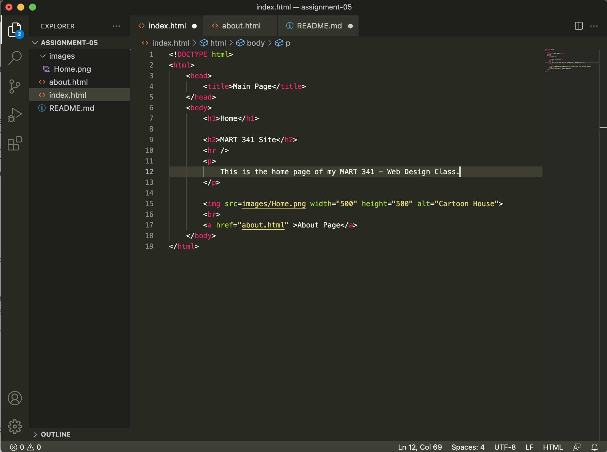

# Assignment 05

- I visited YouTube on Jan, 1 2006. It was suprising to see the difference
 in layout and use of color. Instead of the modern aesthetic of larger thumbanils 
 on a plain white background, the titles and descriptions took prescedant and
 were larger on the page. Also the page didnt extend all the way to the sides
 of the broswer window. I wasn't sure if this was caused by the wayback machine 
 or if the website looked this way to fit more screen types. 

 - 