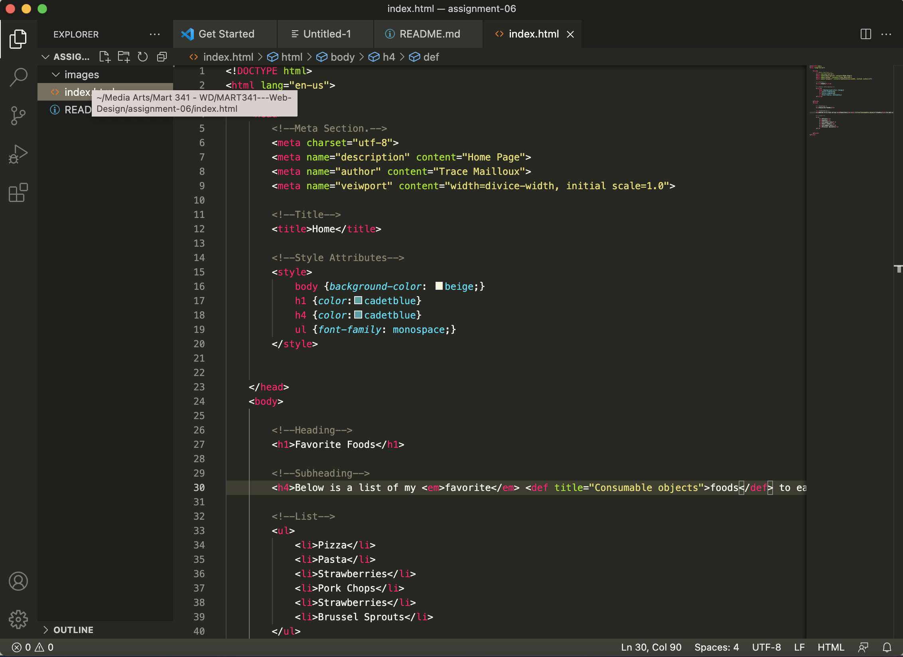

# Assignment 06

- Structural markup is used to help create a cohesive outline for a page. Through the use of tags, the author allows the document to be read by the browser, DOM, and any other potential coders by creating a framework for teh content and text that can be easily interpreted. 

- Semantic markup is used in relation to the language and content you are trying to emphasize or display. This can allow the author to make text bold or italicized, or allow the author to embed word or phrase definitons right in the browser.   

- 