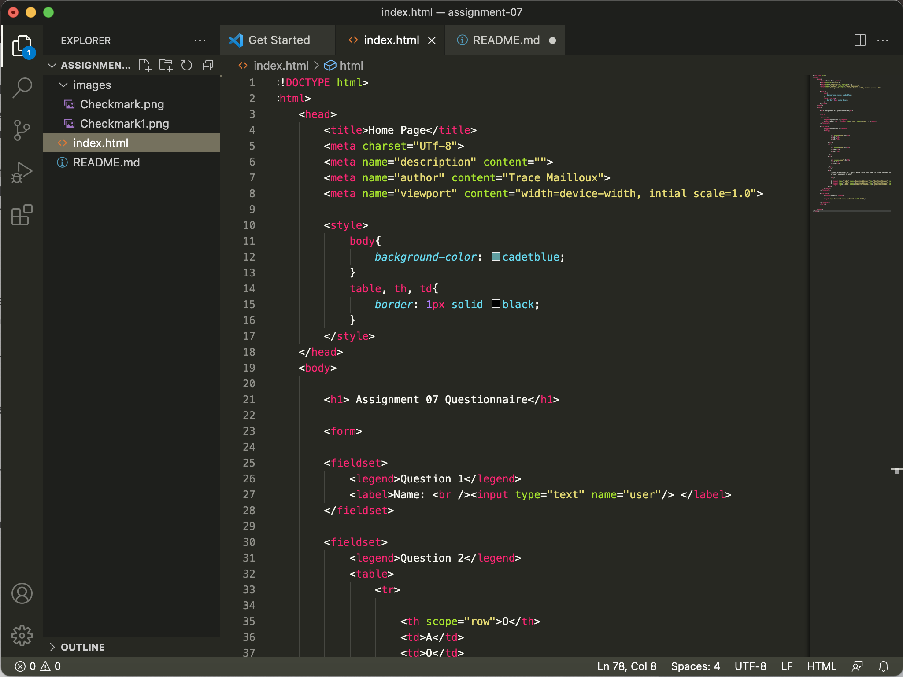

# Assignment 07

- The most common forms I come across day to day are forms asking for my information like my name, age, location, and financial information like my
debit card or bank account numbers. These have the purpose of logging my information for future use like logging in to ceratin platforms, tracking my preferences, and allowing me to buy things online. 

- 