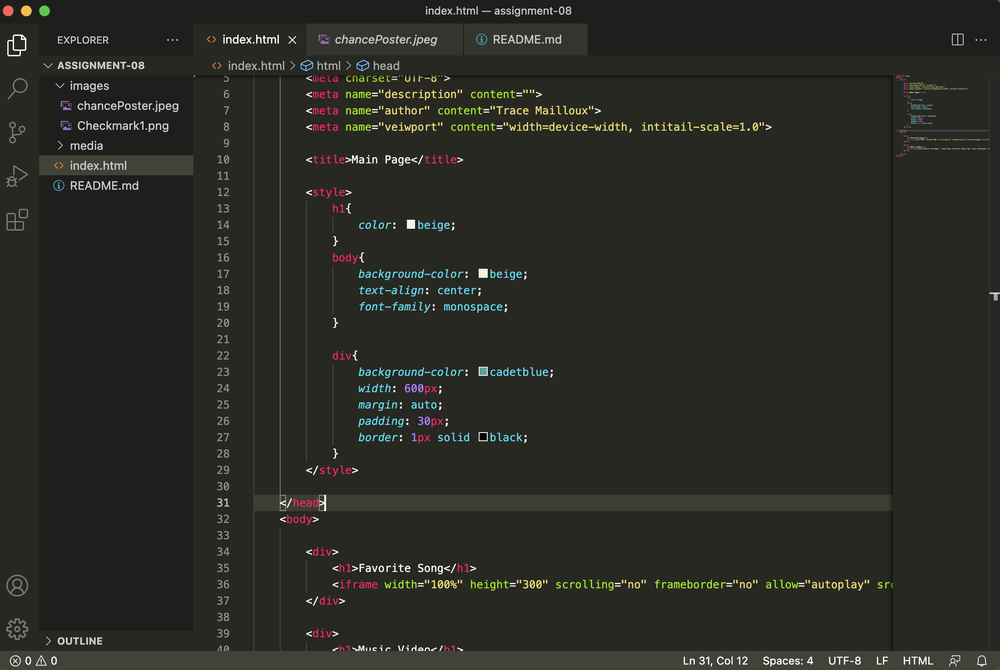

# Assignment 08

- Affordances can be descibed as the utility or actions available to an object or actions commonly assigned to an object. Like pressing a button or ascending and descending stairs.

- Using a third party host allows you to embed larger files like videos without having to worry about converting the files so you can store loacally and you dont have to worry about maintenance. Although, this can allow you to face unforeseen issues if the hosting website goes down or has issues. 

- 