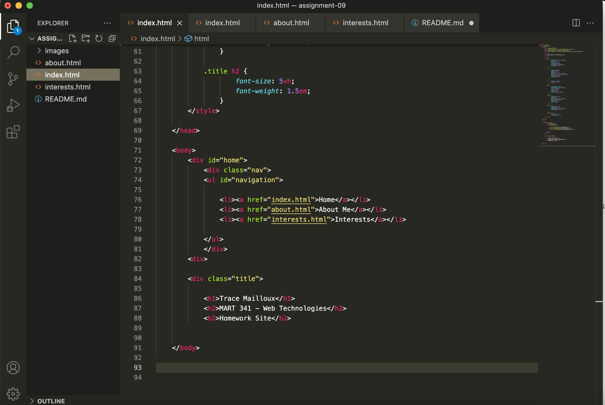

# Assignment 09

- I feel comfortable with HTML and am happy with my performance in terms of being able to create on screen what I want to see. I still have issue remembering all the syntax and rules, but by troubleshooting (and googling) I can usually find the solutions. 

- Like I said in the 'About Me' section, I already had experience with CSS through the MART 441 class and was even able to recycle some sections of code for the styling, so I feel comfortable with that as well.

- 