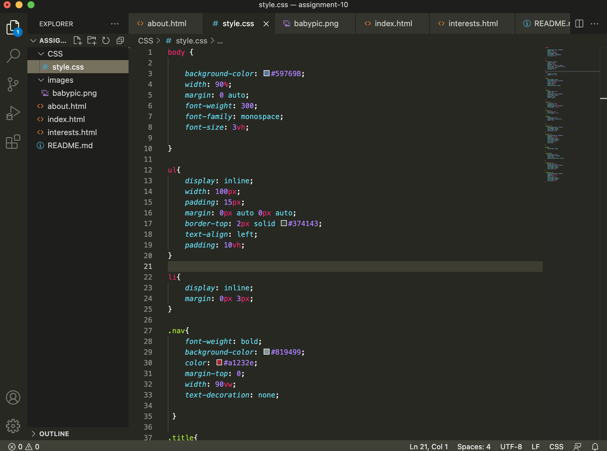

## Assignment 10

- Universal - Styles everything on the page.
- Element - Styles a specific element. Would use if wanted a consistent look in titles or bodies of text.
- Class - Stlyes a specific group of elements. Would use for elements that have similar information or uses.
- Id - Styles a single specific element. 

- I chose my color scheme of dark blue contrasted by off white and shades of green because they seemed plaseant to look at and weren't overwhelming when taking up a lot of the page as my main content is rather small. 

- 